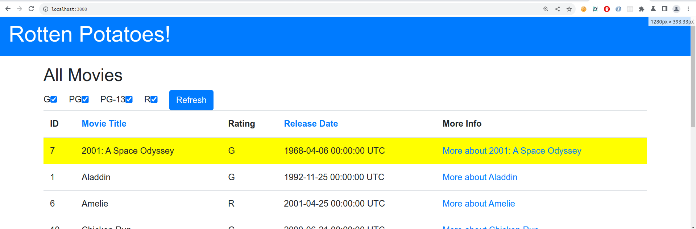

# Preguntas Introduccion a Rails

- Modifica la vista Index para incluir el número de fila de cada fila en la tabla de películas.

Para ello, agregamos una columna ID al header de la tabla y una columna adicional para cada fila de las movies agregadas.

```ruby 
<thead>
    <tr>
      <th>ID</th>
      <th class="<%=@title_header_class%>" ><%= link_to "Movie Title", movies_path(sort: 'title', direction: toggle_direction('title'), ratings: hash_ratings(@ratings_to_show)), id: 'title_header' %></th>
      <th>Rating</th>
      <th class="<%=@release_date_header_class%>" ><%= link_to "Release Date", movies_path(sort: 'release_date', direction: toggle_direction('release_date'), ratings: hash_ratings(@ratings_to_show)), id: 'release_date_header' %></th>
      <th>More Info</th>
    </tr>
  </thead>
  <tbody>
    <% @movies.each do |movie| %>
      <tr>
        <td>
          <%=movie.id%>
        </td>
        <td>
          <%= movie.title %>
        </td>
        <td>
          <%= movie.rating %>
        </td>
        <td>
          <%= movie.release_date %>
        </td>
        <td>
          <%= link_to "More about #{movie.title}", movie_path(movie) %>
        </td>
      </tr>
    <% end %>
  </tbody>
```
Con `movie.id` obtenemos el numero de fila

- Modifica la vista Index para que cuando se sitúe el ratón sobre una fila de la tabla, dicha fila cambie temporalmente su color de fondo a amarillo u otro color.

Le asigne a cada fila una clase `fila_tabla`, y use CSS para implemtar `:hover`. En `assets/application.css` agregué estas lineas de código.
```css
.fila_tabla:hover{
  background-color: yellow ;
}
```

- Modifica la acción Index del controlador para que devuelva las películas ordenadas alfabéticamente por título, en vez de por fecha de lanzamiento. No intentes ordenar el resultado de la llamada que hace el controlador a la base de datos. Los gestores de bases de datos ofrecen formas para especificar el orden en que se quiere una lista de resultados y, gracias al fuerte acoplamiento entre ActiveRecord y el sistema gestor de bases de datos (RDBMS) que hay debajo, los métodos find y all de la biblioteca de ActiveRecord en Rails ofrece una manera de pedirle al RDBMS que haga esto.

Modificamos el método index de `movies_controller.rb` para ordenar las peliculas de la base de datos.

```ruby
@movies = @movies.order(title: :asc)
```
La instancia @movies estará ordenada por el campo `title` y de manera ascendente.

